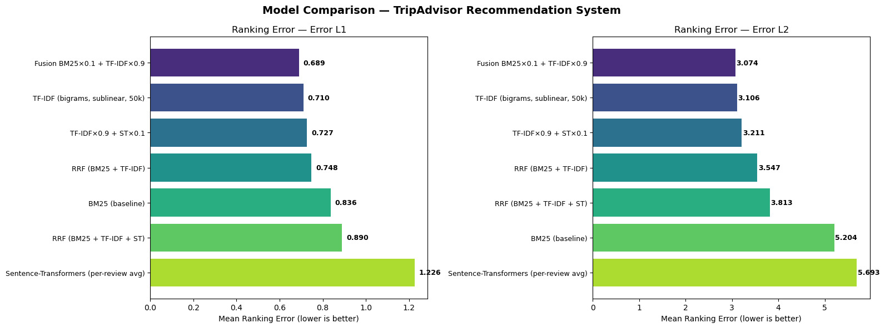
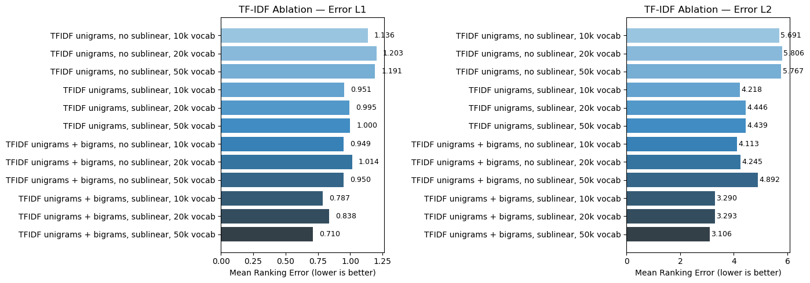
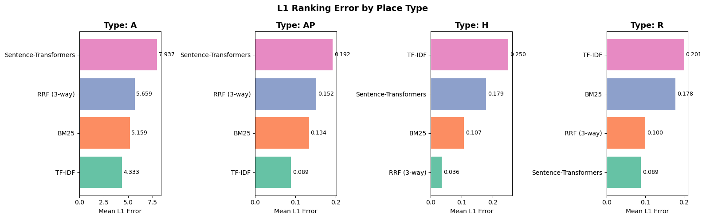

# 🗺️ TripAdvisor NLP Recommendation System

> Content-based place recommendation using **review text only** — no metadata, no shortcuts.  
> Built as part of the Information Retrieval & NLP course — ESILV A4 DIA6 (2026).



---

## The Idea

Given the reviews of a TripAdvisor place, can we recommend the most similar places **without looking at any metadata**?

The core hypothesis: **similar experiences are described with similar words**. A great museum and another great museum should sound alike in reviews, even if we never tell the model what category either belongs to.

This project builds and evaluates several retrieval models on a real TripAdvisor dataset covering **hotels, restaurants, and attractions** across Paris.

---

## System Overview

Each place is represented as a **bag of its reviews** (English only). We then apply different retrieval strategies to rank candidate places by similarity.

| Model | Type | Description |
|---|---|---|
| **BM25** | Sparse | Baseline probabilistic ranking |
| **TF-IDF** (50k vocab) | Sparse | Best-performing overall model |
| **TF-IDF variants** | Sparse | Ablation across vocabulary sizes & sublinear TF |
| **Linear Fusion** | Hybrid | Weighted interpolation of BM25 + TF-IDF scores |
| **RRF Fusion** | Hybrid | Reciprocal Rank Fusion of BM25 + TF-IDF |
| **Sentence-Transformers** | Dense | `all-MiniLM-L6-v2` semantic embeddings |

---

## Evaluation

We evaluate using a **Ranking Error** metric on a 50/50 train/test split of places.

- **Level 1 (L1)** — Type match: does the retrieved place share the same type? (`Hotel`, `Restaurant`, `Attraction`, `Attraction Product`)
- **Level 2 (L2)** — Subcategory match: does it share the same subtype? (e.g. cuisine style, attraction subtype, hotel price range)

A ranking error of **0** means the top result is already a correct match. An error of **k** means we had to scroll to position k+1 to find a valid match. Lower is better.

---

## Results

### TF-IDF Ablation Study

Systematic comparison of vocabulary size, n-gram range, and sublinear TF weighting:



### Per-Type Breakdown

L1 error broken down by place type (Hotel, Restaurant, Attraction, Attraction Product):



---

## Key Findings

- **TF-IDF (50k vocab)** outperformed all other models at both L1 and L2
- **Sentence-Transformers underperformed** BM25 — likely due to domain mismatch and the noisy, informal nature of review text
- **Attractions** showed significantly higher L2 errors than hotels and restaurants, reflecting greater subcategory diversity
- Fusion models (RRF, linear) showed mixed results — gains in some types, marginal elsewhere

---

## Repository Structure

```
tripadvisor-nlp-recommender/
├── notebook.ipynb        # Full pipeline: preprocessing → models → evaluation → demos
├── report.pdf            # Written report with methodology, results & analysis
├── requirements.txt      # Python dependencies
├── results/              # Evaluation charts
│   ├── model_comparison.png
│   ├── tfidf_ablation.png
│   └── per_type_breakdown.png
├── data/
│   └── README.md         # Expected data files and format description
└── README.md
```

---

## Setup & Usage

**1. Clone the repo**
```bash
git clone https://github.com/Loro67/tripadvisor-nlp-recommender.git
cd tripadvisor-nlp-recommender
```

**2. Install dependencies**
```bash
pip install -r requirements.txt
```

**3. Add the data files**

See [`data/README.md`](data/README.md) for the expected files and format.

**4. Run the notebook**
```bash
jupyter notebook notebook.ipynb
```

---

## Tech Stack

- **Python 3.10+**
- [`rank-bm25`](https://pypi.org/project/rank-bm25/) — BM25 baseline
- [`scikit-learn`](https://scikit-learn.org/) — TF-IDF vectorization
- [`sentence-transformers`](https://www.sbert.net/) — Dense embeddings (`all-MiniLM-L6-v2`)
- `pandas`, `numpy` — Data processing
- `seaborn`, `matplotlib` — Visualizations

---

## Authors

**Alvaro Serero** & **Leo Winter** — ESILV A4 DIA6, 2026
